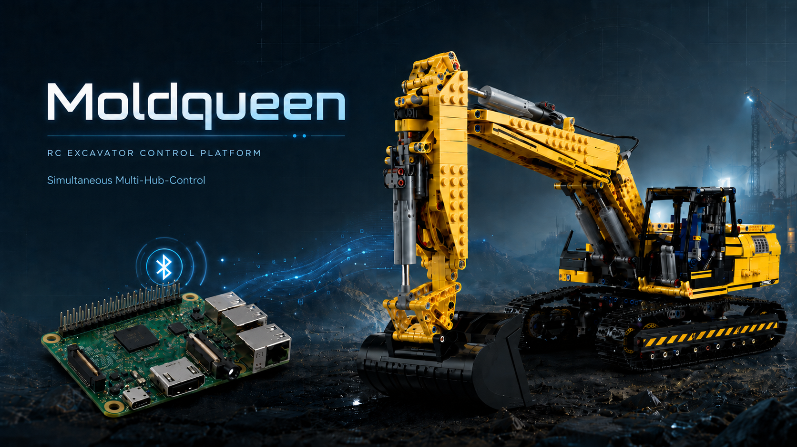
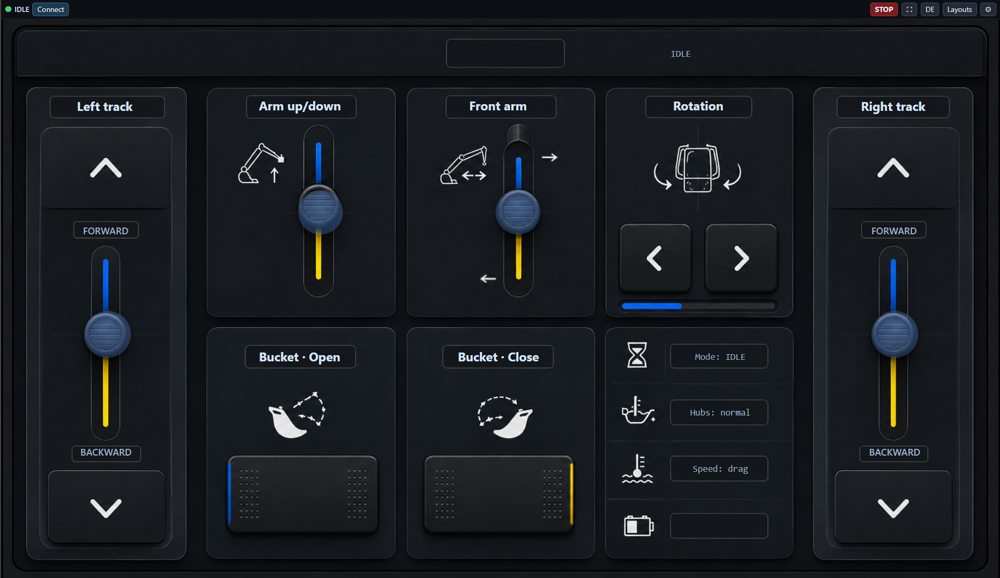

<h1> moldqueen</h1>

[](LICENSE)


[](#highlights)

**Drive a [Mould King 13112](https://www.mouldking.com/) RC excavator from a Raspberry Pi — over a reverse-engineered BLE protocol, through a clean WebSocket API.**

<p align="center">
  
</p>

`moldqueen` turns a Lego-compatible building-block excavator (two stock
battery/Bluetooth hubs, ~6 motorised functions) into a programmable machine. The
hubs aren't connected to over GATT — they're commanded by **broadcasting crafted
BLE advertising "telegrams."** We captured and decoded the official app's
protocol, rebuilt its crypto, and wrapped it in a small two-process control
service with a web GUI and a documented API — the foundation for later adding a
camera, a TOF sensor, and a local AI brain that drives the machine through the
same API.

**Multi-purpose — not just the excavator.** The protocol and control core are
*toy-agnostic*: they drive the **Mould King BLE hubs**, not one specific model. So
anyone with a Mould King set built on these hubs can use moldqueen — the **13112
excavator** is simply the first, hardware-proven **reference layout**, and the
**pluggable-layout system** lets you add a layout for **your own toy** (its own
functions and dashboard) without touching the control core. Honest scope: the
excavator is what's been verified on real hardware; a different toy will need its own
layout — which the system now supports. Start here:
[`docs/ADDING_A_LAYOUT.md`](docs/ADDING_A_LAYOUT.md).

> **Status:** ✅ **core goal achieved** — *two hubs driven simultaneously from a
> single telegram on a single radio.* Working webservice + a **landscape dashboard**
> GUI (`/excavator`, chosen from the `/` layout chooser) with drag-joysticks, a
> connection wizard, and an in-GUI **channel-assignment** tool over a configurable
> channel map; plus a **RAW** debug layout and a **pluggable-layout** system
> (manifest + server-derived routes + per-layout function maps + a copyable template).
> 🔜 Next: finish the channel map, an AI/console client, then camera + sensors.

## Disclaimer

> [!WARNING]
> **Independent, unofficial project — no warranty, use at your own risk.**
>
> - **Not affiliated.** This is an independent, unofficial hobby project. It is
>   **not** affiliated with, authorized by, endorsed by, or sponsored by **Mould
>   King**, **Shenzhen Yuxing**, or any related entity. "Mould King" and "MK+tech"
>   are trademarks of their respective owners, used here **only descriptively** for
>   interoperability.
> - **Interoperability / reverse-engineering.** The BLE protocol was
>   reverse-engineered for **interoperability with hardware the author owns**, and
>   is provided for **educational and personal use** only.
> - **No warranty.** This software is provided **"as is", without warranty of any
>   kind.** The author is **not liable** for any damage to hardware, hubs, models,
>   property, or anything else arising from its use — **you assume all risk.** This
>   complements, and does not replace, the MIT license's no-warranty clause.

🚀 **In a hurry? [`docs/QUICKSTART.md`](docs/QUICKSTART.md)** — fastest path from boxes to driving.

📖 **Canonical, exhaustive reference: [`docs/PROJECT.md`](docs/PROJECT.md).** This
README is the tour; PROJECT.md is the source of truth.

---

## Table of contents

- [Disclaimer](#disclaimer)
- [What you get](#what-you-get)
- [Highlights](#highlights)
- [Screenshots](#screenshots)
- [How it works](#how-it-works)
- [The protocol (MK4 12-channel nibble)](#the-protocol-mk4-12-channel-nibble)
- [Architecture](#architecture)
- [API server (required) + client UI (optional)](#two-pieces-api-server-required--client-ui-optional)
- [Hardware](#hardware)
- [Quick start](#quick-start)
- [Set it up with an AI assistant](#set-it-up-with-an-ai-assistant)
- [The WebSocket API](#the-websocket-api)
- [Channel map](#channel-map)
- [How the protocol was reverse-engineered](#how-the-protocol-was-reverse-engineered)
- [Safety model](#safety-model)
- [Troubleshooting](#troubleshooting)
- [Repository layout](#repository-layout)
- [Roadmap & open problems](#roadmap--open-problems)
- [Development](#development)
- [Credits & license](#credits--license)

---

## What you get

- **Simultaneous multi-hub control** — one MK4 BLE telegram moves several hubs at
  once, with no per-device pairing.
- **A clean WebSocket API first** — the control core is an API; build your own client
  (console, app, AI agent) against a documented **AsyncAPI 3.0** spec.
- **Multi-language web client** — a polished dashboard with a **6-language picker**
  (EN/DE/ZH/KO/ES/FR) so kids can drive in their own language; run it on the Pi or
  anywhere as a container.
- **RAW debug mode** — a low-level bench for crafting and reading BLE telegrams
  directly: how the protocol was reverse-engineered, now a built-in tool.
- **Future-proof radio** — talks to the adapter over **raw HCI sockets** (no reliance
  on deprecated `hcitool`), behind a swappable backend.
- **Portable core** — the API and control logic are plain Python, **architected to
  run on other Linux SBCs** (anywhere with BlueZ + a BLE adapter); proven today on the
  Raspberry Pi.
- **Pluggable layouts** — the excavator is the reference layout; add one for *your*
  Mould King toy via the manifest, no core changes
  ([`docs/ADDING_A_LAYOUT.md`](docs/ADDING_A_LAYOUT.md)).
- **Multi-device by design** — the protocol addresses **up to 3 hub slots**, so a
  single telegram can drive several toys/hubs together.
- **Safe by default** — motors snap to **neutral** on disconnect, zero clients, STOP,
  or leaving the READY state; a dry-run mode logs every telegram and transmits nothing.
- **AI-assisted setup** — hand the repo to an AI agent and let it walk the install; the
  docs (QUICKSTART · PROJECT · CLAUDE.md) are written to be agent-friendly.

---

## Highlights

- **Reverse-engineered the real control protocol.** The hubs use the **MK4
  12-channel nibble** protocol (not the MK6.0 "per-device" model we — and the
  public reference — first assumed). One telegram carries **12 nibbles = 3 slots ×
  4 channels** and drives **all hubs at once**.
- **Recovered + verified the cipher.** `mouldking_crypt.py` (`encode`/`decode`)
  reproduces the official app's on-air bytes **exactly** (13/13 self-tests) — which
  is what let us decode captured adverts and discover the protocol.
- **Two-hub simultaneous control, one radio.** A single advert with two channel
  blocks set moves both boxes at the same time. No per-device addressing, no second
  dongle required.
- **A real service, not a script.** A `broadcaster` (owns the radio, holds state,
  auto-neutral safety) + a `WebSocket API` (the product) + an **AsyncAPI 3.0 spec**.
- **A landscape dashboard GUI** (the landing page). Controls bind to **functions**
  via a **configurable channel map** (persisted default + live overrides); drag-
  joysticks for tracks/arms, a **connection wizard** for cold-start, and a built-in
  **channel-assignment** tool (drive a control → see which motor moves → assign it,
  with per-function max speed + reverse trim + invert + EN/DE labels). Responsive:
  top-bar on desktop, left-sidebar on mobile.
- **Multi-purpose platform.** The control core is **toy-agnostic** — it drives the
  hubs, not a model. The 13112 excavator is the worked **reference layout**; the
  **pluggable-layout** system (manifest + per-layout function maps + a copyable
  template) lets anyone add a layout for a *different* Mould King toy —
  [`docs/ADDING_A_LAYOUT.md`](docs/ADDING_A_LAYOUT.md).
- **Safety first.** Disconnect / no-clients / API-death → motors go **neutral**.
  A dry-run mode logs every telegram and transmits nothing.

---

## Screenshots

The excavator dashboard — full visual tour (start page · dashboard · wizard ·
channel settings) in **[`docs/SCREENSHOTS.md`](docs/SCREENSHOTS.md)**.

<p align="center">
  <a href="docs/SCREENSHOTS.md"></a>
</p>

---

## How it works

The excavator's two hubs are **broadcast receivers**: they listen for BLE
advertising packets whose manufacturer data (company id **`0xFFF0`**) is a crafted,
obfuscated **telegram**. To control them you:

1. Stop/mask `bluetoothd` and take a Bluetooth adapter raw.
2. Broadcast a **connect** telegram so the hubs enter listen mode.
3. Continuously broadcast a **motion** telegram whose 12 nibbles encode every
   channel's speed/direction. Re-broadcast a neutral telegram to hold/stop.

That's it — connectionless, one-to-many. One adapter can drive every hub.

```
 phone app  ──(BLE adverts, 0xFFF0)──►  ┌─────────┐   we replaced the phone with:
                                        │  hubs   │
 Raspberry Pi ──(BLE adverts, 0xFFF0)──►└─────────┘   moldqueen on a USB dongle
```

## The protocol (MK4 12-channel nibble)

Telegrams are **raw bytes → `MouldKingCrypt` → 24-byte manufacturer data** (company
`0xFFF0`). The raw bytes are what carry meaning:

| Telegram | Raw bytes | Meaning |
|----------|-----------|---------|
| **Connect** | `ad ae 18 80 80 80 f3 52` | put hubs in listen mode |
| **Motion**  | `7d ae 18 ⟨6 channel bytes⟩ 82` | drive channels |
| **Neutral** | `7d ae 18 88 88 88 88 88 88 82` | all stop |

The **6 channel bytes hold 12 nibbles = 3 slots × 4 channels** (even channel = high
nibble, odd = low; byte offset `3 + ch//2`):

```
            byte3   byte4   byte5   byte6   byte7   byte8
nibbles:   [c0 c1] [c2 c3] [c4 c5] [c6 c7] [c8 c9] [c10 c11]
slots:     └── slot 0 ──┘ └── slot 1 ──┘ └──── slot 2 ────┘
```

- **`0x8` = neutral/stop**; `>0x8` = one direction, `<0x8` = the other.
- **One telegram drives all hubs at once** — a hub is addressed by *which nibble
  block* moves. A hub's slot is chosen by its **physical button** (1/2/3 flashes =
  slot 0/1/2) and resets to slot 0 on power-cycle.
- **value ↔ nibble** (used by the API): `nibble = 0x8 + value`, value `-7..+7` →
  nibble `0x1..0xF` (`0`→`0x8`, `+7`→`0xF`, `-7`→`0x1`).

The **`MouldKingCrypt`** obfuscation (recovered from the app and verified): fixed
preamble `C1..C5`, per-byte bit-reversal, CRC-16/CCITT (poly `0x1021`), and two
7-bit LFSR whitening passes (seeds 63 / 37). See
[`bt-core/reference/mouldking_crypt.py`](bt-core/reference/mouldking_crypt.py).

> **Why this matters:** the widely-referenced
> [`J0EK3R/mkconnect-python`](https://github.com/J0EK3R/mkconnect-python) MK6.0
> model (`0x61`/`0x62` "device 0/1", button "promotion") **does not apply to these
> hubs** — chasing it cost real time. Our hubs are MK4 nibble. Full post-mortem in
> [`docs/PROJECT.md`](docs/PROJECT.md) §3.

## Architecture

Two processes over a local Unix socket — deliberately split so the **WebSocket API
is the product** and the web page is merely its first client (a console or AI brain
uses the *same* API):

```
┌────────────────────────────────────────────────────────────────────┐
│  bt-core/mk4web/                                                     │
│                                                                      │
│   web page / AI brain / CLI                                          │
│        │  WebSocket  (JSON, :8765)                                   │
│        ▼                                                             │
│   ┌──────────┐   Unix socket    ┌──────────────┐    BLE adverts     │
│   │   api    │ ───────────────► │  broadcaster │ ──(raw HCI socket)─► hubs
│   │  :8080   │   12-nibble      │  owns radio  │     company 0xFFF0  │
│   │  :8765   │   state + setup  │  + state +   │                     │
│   └──────────┘                  │  lifecycle   │                     │
│   serves page +                 └──────────────┘                     │
│   the WS API                    IDLE→CONNECTING→READY, auto-neutral  │
└────────────────────────────────────────────────────────────────────┘
```

- **`broadcaster.py`** — owns the radio and the authoritative 12-nibble state; runs
  a lifecycle **IDLE → CONNECTING → READY**; keepalive-broadcasts (~5/s) one MK4
  telegram reflecting state. Reverts to neutral/IDLE if the API goes away. The radio
  sits behind a backend abstraction: **`rawhci`** (raw `AF_BLUETOOTH`/`BTPROTO_HCI`
  socket, no hcitool dependency) is the default; `hcitool` is a legacy fallback
  (`MK4_RADIO_BACKEND`). Resolve the dongle **by MAC** — the `hciN` index varies.
- **`api.py`** — the WebSocket server (the product), also serves the static page;
  owns/drives the lifecycle, maps `value→nibble`, enforces motion-only-in-READY,
  and pushes state to clients. Disconnect/no-clients → NEUTRAL.

## Hardware

| Part | Detail |
|------|--------|
| Control box | Raspberry Pi 3B (aarch64, 1 GB RAM) |
| **Radio (use this)** | **Realtek RTL8761B USB dongle** `00:A6:44:02:21:25` (resolve by MAC; the `hciN` index varies across replugs/reboots) |
| Spare radio | hci2 = TP-Link USB dongle `6C:4C:BC:87:D0:83` (one radio is enough) |
| Avoid | Onboard Broadcom UART BT (hci0) — corrupts frames *at the connect transition*; plan to disable via `dtoverlay=disable-bt` |
| Power | **Solid 5 V / 3 A** — under-voltage caused real failures; a weak PSU is the #1 gremlin |

`bluetoothd` must be **stopped + masked** (it's dbus/socket-activated and will
re-grab the adapter); raw HCI needs root or `cap_net_raw,cap_net_admin`.

## Two pieces: API server (required) + client UI (optional)

moldqueen is two cleanly separable features:

- **API server — REQUIRED.** The broadcaster (owns the radio) + the **WebSocket API**
  (the product). The WebSocket is *always* opened; this is what actually controls the
  excavator. Runs on the Pi.
- **Client web UI — OPTIONAL.** The chooser/excavator/RAW pages are a convenience for
  *driving* the API. They're not required to control the machine.

Three ways to use it:

1. **API serves the page too (easiest).** `scripts/start.sh` → open `http://<pi>:8080/`.
2. **Run the client separately.** Serve the UI elsewhere (Docker on a desktop) and
   point it at the Pi's WS via the in-app endpoint setting — see
   [Running the client separately](#running-the-client-separately-docker) and
   [`docs/REMOTE_CLIENT.md`](docs/REMOTE_CLIENT.md).
3. **Bring your own client.** Skip the page entirely and talk to the WebSocket from
   your own code/console/AI — contract in [`asyncapi.yaml`](bt-core/mk4web/asyncapi.yaml).

**Server flags** (the API): `--ws-only` (or `--no-client`, env `MK4_SERVE_CLIENT=0`)
runs the **WebSocket only — no HTTP server** (headless / bring-your-own-client);
`--http-port N` serves the page on `N` (default `8080`; CLI wins over `MK4_HTTP_PORT`).
The WebSocket port is its own setting (`MK4_WS_PORT`, default `8765`).

```bash
python -m mk4web.api                  # WS :8765 + client page :8080   (default)
python -m mk4web.api --http-port 9000 # WS :8765 + client page :9000
python -m mk4web.api --ws-only        # WS :8765 only  (no web server)
scripts/start.sh --ws-only            # launcher, websocket-only
```

## Quick start

**One-time setup** (Python venv + the one dependency):

```bash
cd bt-core
python3 -m venv .venv && source .venv/bin/activate
pip install -r requirements.txt        # websockets (+ pytest)
```

**Easiest — the launcher.** [`scripts/start.sh`](scripts/start.sh) preflight-checks
the radio (bluetoothd; the dongle *by MAC*, so a reindex doesn't matter; the venv)
and starts the broadcaster + API in the right order. It makes **no persistent system
changes** — it may mask bluetoothd and bring the dongle up *for the session*, both
reversible:

```bash
scripts/start.sh            # preflight + launch (live)  →  http://<pi-ip>:8080/
scripts/start.sh --dry-run  # logs telegrams, transmits NOTHING
scripts/start.sh --check    # audit only — report state, change nothing  (= scripts/check.sh)
```

### Manual alternative

```bash
# what the launcher does: free the adapter from bluetoothd, bring the dongle up
sudo systemctl mask --now bluetooth
sudo hciconfig hci1 up
cd bt-core && source .venv/bin/activate
```

**Dry-run first** (logs the telegrams, transmits *nothing*):

```bash
python -m mk4web.broadcaster --dry-run   # terminal 1
python -m mk4web.api                       # terminal 2  →  http://<pi-ip>:8080/
```

**Live** (drives the dongle):

```bash
sudo python -m mk4web.broadcaster          # starts IDLE — no transmit until "Connect"
python -m mk4web.api
```

**Cold-start flow** — open the dashboard at `http://<pi-ip>:8080/` and press
**Connect** to launch the wizard:

1. Power on both hubs (each shows one long flash) → **Next**.
2. *Connecting…* → hubs fast-flash.
3. Press **one** hub's button to **two** fast flashes (→ slot 1); leave the other
   on one flash (→ slot 0). *(Different slots are required for independent control.)*
4. **Ready** → controls unlock. Drag a joystick to drive (release snaps to stop);
   **STOP** (or Space/Esc) = all neutral.

All ports/HCI are env-overridable (`MK4_HCI`, `MK4_HTTP_PORT`, `MK4_WS_PORT`, … —
see [`bt-core/mk4web/config.py`](bt-core/mk4web/config.py)).

### Layouts: chooser, dashboard, RAW

**`/`** serves a **layout chooser** — pick **Excavator** (`/excavator`) or **RAW**
(`/raw`); it remembers your choice (a "Layouts" button / `/?choose` returns to it).
An **About** overlay carries the disclaimer, credits, licensing, AI note, and author.

**`/excavator`** is the **landscape excavator dashboard**, laid out over an HMI
background (see [`docs/mould_king_13112_hmi_layout_spec.md`](docs/mould_king_13112_hmi_layout_spec.md)).
**`/raw`** is a **RAW debug** layout — a protocol-level test bench over the low-level
`set`/`stop` path: choose 1-3 slots, set each channel directly, build + send the
telegram, and a console logs the exact bytes (raw + on-air AD).

- **Controls bind to functions** (left/right track, arm lift, front arm, rotation,
  bucket) via a **configurable channel map**, not raw channels. Tracks + arm
  functions are **proportional drag joysticks** (drag = speed, release snaps to
  neutral); rotation and bucket are press-and-hold buttons.
- **Connection wizard** — a centered modal walks the cold-start (power on → connect
  → assign slots → ready), with media slots and EN/DE text.
- **Settings** (centered overlay) = the **channel-assignment tool**: drag/Test a
  control, see which motor moves, set its slot/channel + max speed + reverse-trim +
  invert; a separate **Labels** page (EN/DE); **Save** (this session) or **Promote**
  (save as the new default in the layout's `config/channel_map.<layout>.json`).
  Plus a session-only **device-0/1 hub swap**.
- **Responsive shell** — viewport-fit (no page scroll); the menu is a **top bar on
  desktop, a left sidebar on mobile** (portrait *and* landscape); **EN/DE** toggle,
  fullscreen, and **STOP** are always reachable.

The channel map has a persisted **server default** and a **client active** map
(default + overrides); the **server** resolves `function → (slot, channel, value)`
so the broadcaster stays dumb. *(The **RAW** layout (`/raw`) is the slot/channel test
bench over raw `set`/`stop`.)*

### Running as a service (optional)

The launcher is the **no-system-changes default** — run it whenever you want the
service. If you'd prefer it to **auto-start on boot**, that's an optional
convenience you can add yourself with a small **systemd** unit (mask `bluetooth`,
`hciconfig <hci> up`, then launch the broadcaster + API). The project intentionally
ships **no** systemd units, so cloning it makes no persistent change to your system.

### Running the client separately (Docker)

The web UI can run **anywhere** and talk to the Pi's WS API over the LAN — the
broadcaster + radio stay on the Pi. A **client-only** image
([`Dockerfile.client`](Dockerfile.client)) serves just the static UI (chooser +
dashboard + RAW) behind nginx:

```bash
docker build -f Dockerfile.client -t moldqueen-client .   # from the repo root
docker run --rm -p 8080:80 moldqueen-client               # → http://localhost:8080/
```

Then open the **API endpoint** setting (Dashboard **⚙ Settings**, or the RAW **API
connection** panel), enter `ws://<pi-ip>:8765`, and press **Connect** — it's saved
in the browser and the WebSocket reconnects. The endpoint defaults to the page's
own host (so the Pi-served UI needs no setup). The Pi's API is **permissive CORS /
any-WS-origin by design** (LAN hobby tool). Full guide:
**[`docs/REMOTE_CLIENT.md`](docs/REMOTE_CLIENT.md)**.

## Set it up with an AI assistant

Comfortable with AI tools? You can hand the install and setup to an agent. Point an
AI assistant (e.g. Claude Code) at the repo —
**[`github.com/jrichter24/moldqueen`](https://github.com/jrichter24/moldqueen)** — or
just paste this README, and ask it to walk you through getting moldqueen running on
your Pi. The project is written to be **agent-friendly**: [`docs/QUICKSTART.md`](docs/QUICKSTART.md)
is the fast path, [`docs/PROJECT.md`](docs/PROJECT.md) is the exhaustive reference,
and the per-folder [`CLAUDE.md`](CLAUDE.md) files hand an agent the must-knows and
operational gotchas. You still supply the hardware (a Pi, a USB BLE dongle, your
hubs) — the AI handles the software and configuration steps.

## The WebSocket API

The product. Connect to `ws://<pi>:8765`; messages are JSON. Full machine-readable
contract: **[`bt-core/mk4web/asyncapi.yaml`](bt-core/mk4web/asyncapi.yaml)** (AsyncAPI
3.0), also served at `GET /asyncapi.yaml`.

**Client → server**

```jsonc
{ "cmd": "setup", "action": "connect" }              // IDLE → CONNECTING
{ "cmd": "setup", "action": "ready"   }              // CONNECTING → READY
{ "cmd": "setup", "action": "reset"   }              // → IDLE (all neutral)
{ "cmd": "drive", "function": "left_track", "value": 6 } // motion BY FUNCTION (READY only)
{ "cmd": "set", "slot": 1, "channel": 0, "value": 5 } // raw motion by slot/channel (READY only)
{ "cmd": "stop" }                                     // all neutral (any state)
{ "cmd": "map", "action": "get" }                     // get the channel map
{ "cmd": "map", "action": "set",     "map": { … } }   // set the session ACTIVE map
{ "cmd": "map", "action": "swap",    "value": true }  // session device-0/1 (slot 0↔1) swap
{ "cmd": "map", "action": "promote", "map": { … } }   // persist a map as the DEFAULT
{ "cmd": "state" }                                    // re-send current state
```

**Server → client (pushed)**

```jsonc
{ "type": "lifecycle", "state": "READY" }            // on connect + every transition
{ "type": "state", "slots": [[0,0,0,0],[6,0,0,0],[0,0,0,0]] }  // 3 slots × 4 signed values
{ "type": "map", "default": { … }, "active": { … }, "device_swap": false }
{ "type": "mapresult", "action": "set", "ok": true, "errors": [] }
```

`drive` names a **function**; the **server** resolves it to `(slot, channel, value)`
against the active map (applying invert, device-swap, and a per-function
`reverse_scale` trim) so the broadcaster stays dumb. `value` is `-7..+7`; `slot`
`0..2`, `channel` `0..3`. Full contract: [`asyncapi.yaml`](bt-core/mk4web/asyncapi.yaml).

## Channel map

The **function → (slot, channel)** map is **data**, not hardcoded, and **per layout**:
each function-mapped layout declares its function set (in the layout manifest) + a
persisted default in `config/channel_map.<layout>.json` (the excavator's is
[`config/channel_map.excavator.json`](config/channel_map.excavator.json)), editable
live in the GUI. The excavator's six functions, each `{slot, channel, invert, max, reverse_scale, label_en,
label_de}`. The server resolves `drive` against the **active** map (default + the
client's overrides; `promote` saves a map as the new default). Current default —
`bucket`, `left_track`, `arm_lift`, `front_arm` are transmit-confirmed; `rotation`
and `right_track` are placeholders to sweep:

| Function | Slot | Ch | Global nibble | Status |
|----------|------|----|--------------:|--------|
| **bucket** (shovel) | 0 | 0 | ch0 | ✅ confirmed |
| **arm_lift** | 0 | 3 | ch3 | ✅ confirmed (hardware test) |
| rotation | 0 | 2 | ch2 | placeholder |
| **front_arm** | 0 | 1 | ch1 | ✅ confirmed (hardware test) |
| **left_track** | 1 | 0 | ch4 | ✅ confirmed (inverted) |
| right_track | 1 | 2 | ch6 | placeholder |

**Two-hub simultaneous, confirmed:** one telegram with `ch0` *and* `ch4` set moved
both boxes at once. Assign/confirm the rest in **Settings → Test** (drive a control,
watch which motor moves, set its slot/channel). `reverse_scale` (default 1.0) trims
reverse speed to match forward; `max` caps a function's top speed.

## How the protocol was reverse-engineered

A compact case study (details in [`docs/PROJECT.md`](docs/PROJECT.md) and
[`bt-core/reference/MKtech_reverse_engineering_report.md`](bt-core/reference/MKtech_reverse_engineering_report.md)):

1. **Sniffed** the hubs with `btmon` + `hcitool lescan` — they don't advertise;
   they're pure receivers. Dead end for passive discovery.
2. **Followed the public reference** ([mkconnect-python](https://github.com/J0EK3R/mkconnect-python))
   and got *single-hub* motion working with the MK6.0 model — but two-hub
   addressing never worked.
3. **Decompiled** the official `MK+tech` Android app (`jadx`), recovered the
   `MouldKingCrypt` cipher from the Java BLE plugin, and re-implemented it in Python
   (`encode`/`decode`, verified byte-exact).
4. **Captured** the app driving the real hubs and **decoded** the adverts with our
   `decode()` — revealing the true **MK4 12-channel nibble** protocol (one telegram,
   slot-addressed by nibble block). The MK6.0 detour was the wrong model all along.
5. **Re-transmitted** the decoded telegrams from our own dongle → both hubs moved,
   simultaneously, from one advert.

## Safety model

- **Dry-run** (`--broadcaster --dry-run`) transmits nothing; it logs every telegram.
- **Motion is gated** to the `READY` lifecycle state; setup/connect alone never moves a motor.
- **Auto-neutral** on: client disconnect, zero clients, `stop`, or lifecycle leaving READY.
- **Auto-IDLE** (advertising off) if the API process dies (broadcaster sees the socket drop).
- Big **STOP** button in the GUI; per-channel **release-to-stop** on the joystick holds.

## Troubleshooting

First, run the health audit — it reports the radio/service state and **changes nothing**:

```bash
scripts/check.sh          # = scripts/start.sh --check
```

| Symptom | Likely cause | Fix |
|---------|--------------|-----|
| **Page loads, motors don't move** | the **broadcaster isn't running** (only the API is) — the API log shows `IPC: broadcaster not reachable` | start the broadcaster; easiest is `scripts/start.sh` (launches both, in order). |
| **Nothing moves after a reboot** | the broadcaster didn't auto-start, the dongle came back **DOWN**, and/or you haven't re-run **Connect→Ready** | run `scripts/start.sh`, then do the cold-start in the GUI (Connect → press one hub to two flashes → Ready). |
| **Worked before, now flaky / under-voltage** | **weak PSU** (Pi 3 + two dongles is power-hungry; `vcgencmd get_throttled` ≠ `0x0`) | use a solid **5 V / 3 A** supply. |
| **Only one hub moves, or both move together** | the two hubs are on the **same slot** | cold-start and press **one** hub's button to **two** fast flashes (slot 1), leaving the other on one flash (slot 0). |
| **bluetoothd keeps coming back** | it's **socket/dbus-activated** — a plain `stop` gets reactivated as soon as any BT tool touches the adapter | **mask** it: `sudo systemctl mask --now bluetooth` (the launcher does this). Reverse with `sudo systemctl unmask bluetooth`. |
| **Dongle not found / wrong `hciN`** | USB re-enumeration changed the index, or the dongle isn't plugged in | check `lsusb` / `hciconfig -a`. The launcher binds **by MAC** (`MK4_DONGLE_MAC`) so the index doesn't matter — if it still can't find it, the dongle is absent. |

Safety nets always apply: closing the page (client disconnect) or the **STOP** button
forces neutral, and if the API process dies the broadcaster drops to **IDLE**.

## Repository layout

```
moldqueen/
├── docs/PROJECT.md            # canonical project reference (read this)
│   └── mould_king_13112_hmi_layout_spec.md   # dashboard layout coordinates
├── config/channel_map.<layout>.json  # per-layout default channel map (e.g. channel_map.excavator.json)
├── assets/                    # moldqueen_banner.png, moldqueen_icon.png, excavator_icon.png, moldqueen_dashboard_v2.png, wizard/
├── scripts/                   # start.sh / check.sh — preflight + launch (no system changes)
├── bt-core/                   # Python — the radios + the control service
│   ├── mk4web/                # broadcaster · api · telegram · channelmap · mouldking_crypt · config
│   │   ├── asyncapi.yaml       #   WS API contract (served at /asyncapi.yaml)
│   │   └── web/{chooser.html, shell.css, clientconfig.js, layouts.json, dashboard.*, raw.*, template.*}  # / · /excavator · /raw (template inactive)
│   └── reference/             # verified protocol snapshots, the codec, the APK report
├── java-core/                 # empty Java scaffold — future API client OR retire
├── web-gui/                   # original Node scaffold — superseded by mk4web's dashboard
└── CLAUDE.md                  # terse agent/dev notes (per folder too)
```

`java-core/` and `web-gui/` are bootstrap scaffolds the project outgrew; the working
stack is entirely in `bt-core/mk4web/`.

## Roadmap & open problems

- **RAW page + configurable API endpoint** — a dedicated raw slot/channel page to
  replace the retired simple page.
- **Finish the channel map** — sweep/confirm the placeholder channels via Settings → Test.
- **Reverse-speed calibration** — set each track's `reverse_scale` so reverse matches forward.
- **Slot auto-detection — unsolved.** Slots are set by physical button and reset on
  power-cycle; today the **wizard** guides it manually.
- **Box identity UX — unsolved.** Which physical box is on which slot is operator
  knowledge; the map labels by function (EN/DE).
- **Console / AI client** of the WebSocket API (the API is ready; the client isn't).
- **Hardware:** disable onboard BT; keep the 5 V/3 A PSU.
- **Future phases:** camera, TOF sensor, local AI brain — all driving via the WS API.

## Development

- **Add your own layout / toy:** [`docs/ADDING_A_LAYOUT.md`](docs/ADDING_A_LAYOUT.md)
  (the clean path = a generic slot/channel layout, no server change).
- **Run on another board / in a container:** [`docs/PORTING.md`](docs/PORTING.md)
  (the radio core is hardware-bound — honest caveats inside).
- **Minimal dependencies** (1 GB Pi): the service needs only `websockets`.
- **Tests:** `cd bt-core && source .venv/bin/activate && pytest`.
- **Conventions:** small, clear conventional commits (`feat:`/`fix:`/`docs:`/`chore:`);
  secrets never committed.
- Agent/working notes live in the `CLAUDE.md` files (root + per folder).

## Credits & license

- **Author:** Built by Jens Richter. Background in physics and electrical engineering;
  by day I work on tour optimization with genetic and AI algorithms at
  [DNA Evolutions](https://www.dna-evolutions.com/). Find me on
  [LinkedIn](https://www.linkedin.com/in/li-jens-richter). *Built for my son Jonas, who
  loves excavators and helicopters.*
- Protocol groundwork: [`J0EK3R/mkconnect-python`](https://github.com/J0EK3R/mkconnect-python)
  (the MK4/MK6 reference and `MouldKingCrypt`). Our `mouldking_crypt.py` is a
  **port/derivative** of their `MouldKingCrypt`, **used under the MIT License**
  (© 2024 J0EK3R) — see [`THIRD-PARTY-NOTICES.md`](THIRD-PARTY-NOTICES.md) — and
  verified byte-exact against the MK+tech app. Our hubs are the MK4 nibble variant.
  Additional protocol reference: [BrickController2](https://github.com/imurvai/brickcontroller2).
- **Built with AI assistance** — see the *About* overlay on the start page.
- **Independent & unofficial** — not affiliated with Mould King / Shenzhen Yuxing;
  trademarks used descriptively. Provided **as-is, no warranty, use at your own
  risk** — see the full [Disclaimer](#disclaimer).

**License:** [MIT](LICENSE) © 2026 Jens Richter. Bundled third-party code retains its
own license — see [`THIRD-PARTY-NOTICES.md`](THIRD-PARTY-NOTICES.md).
