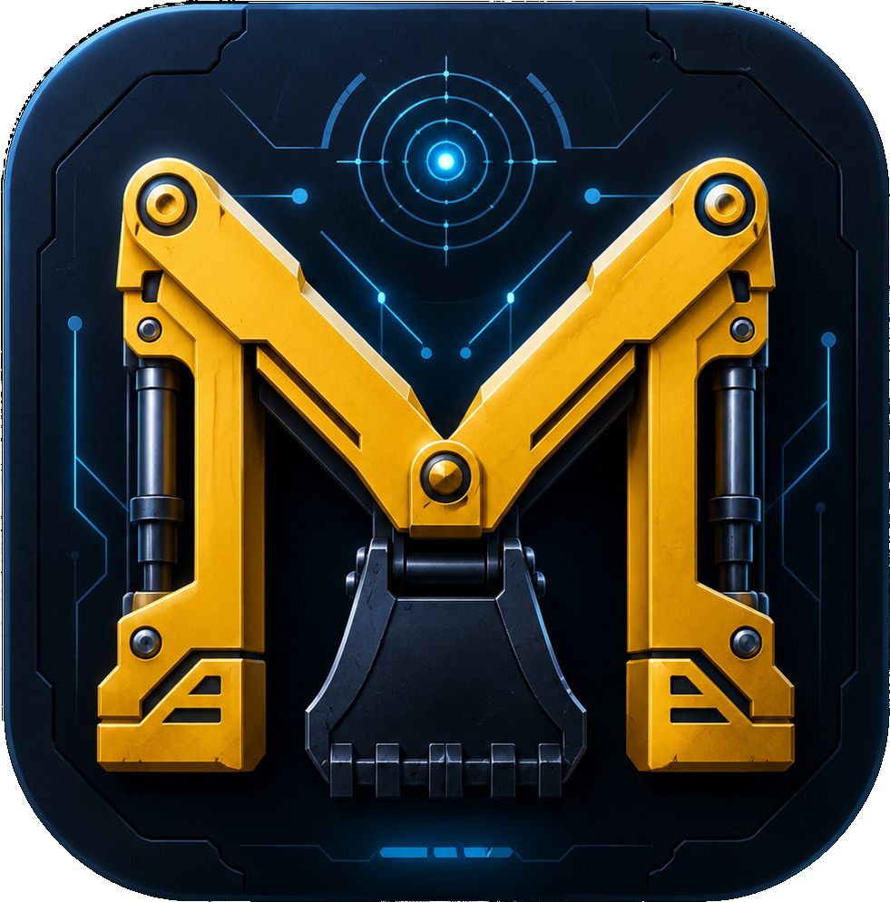
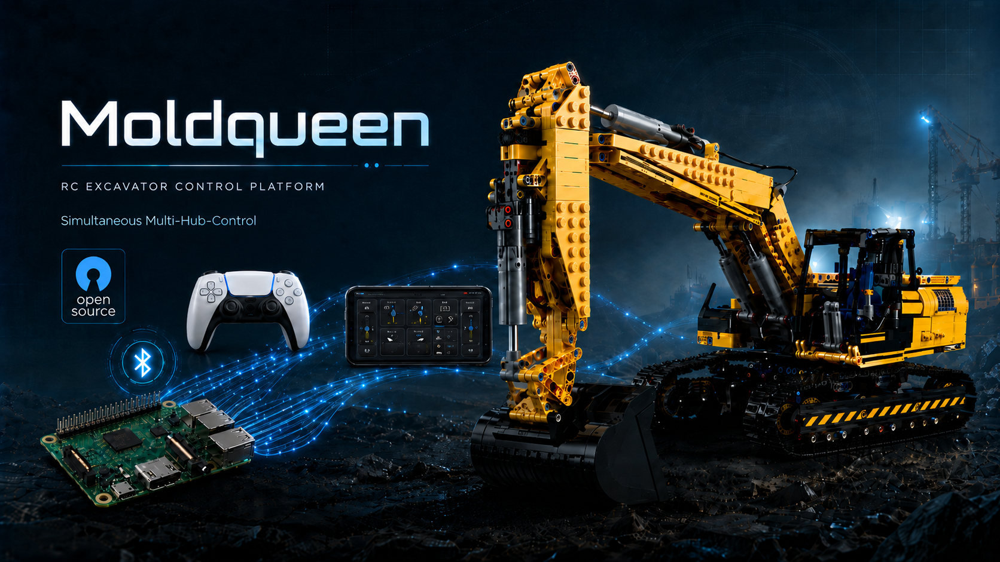
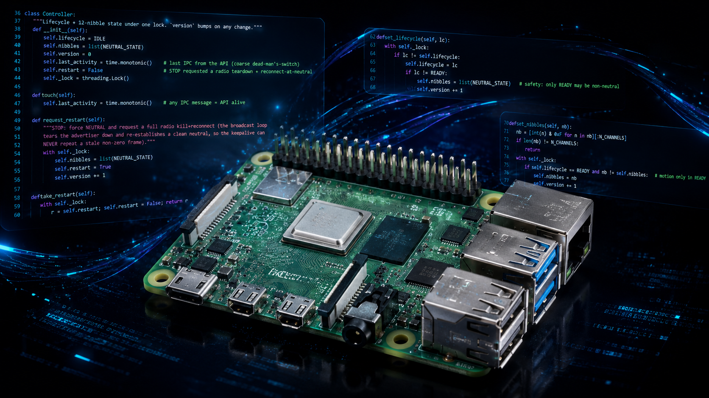
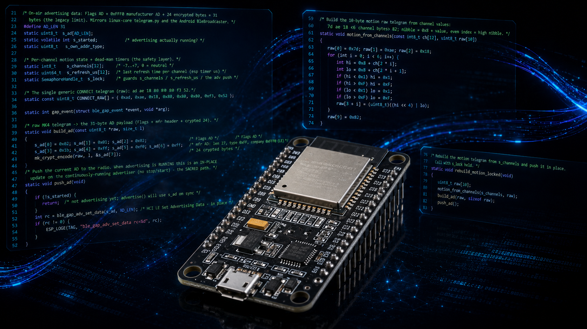
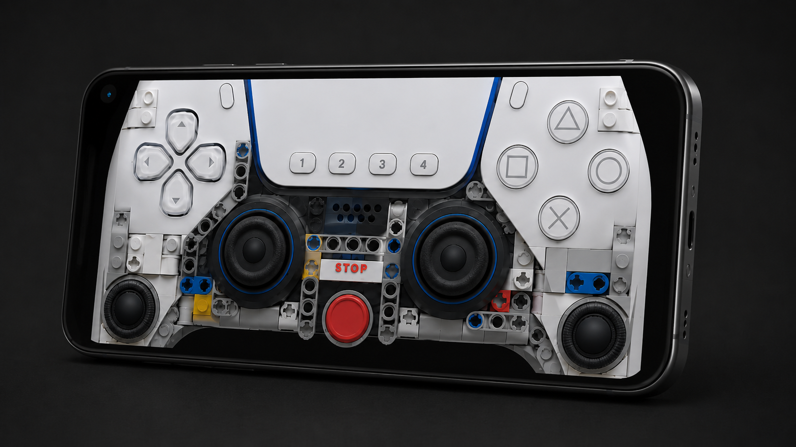
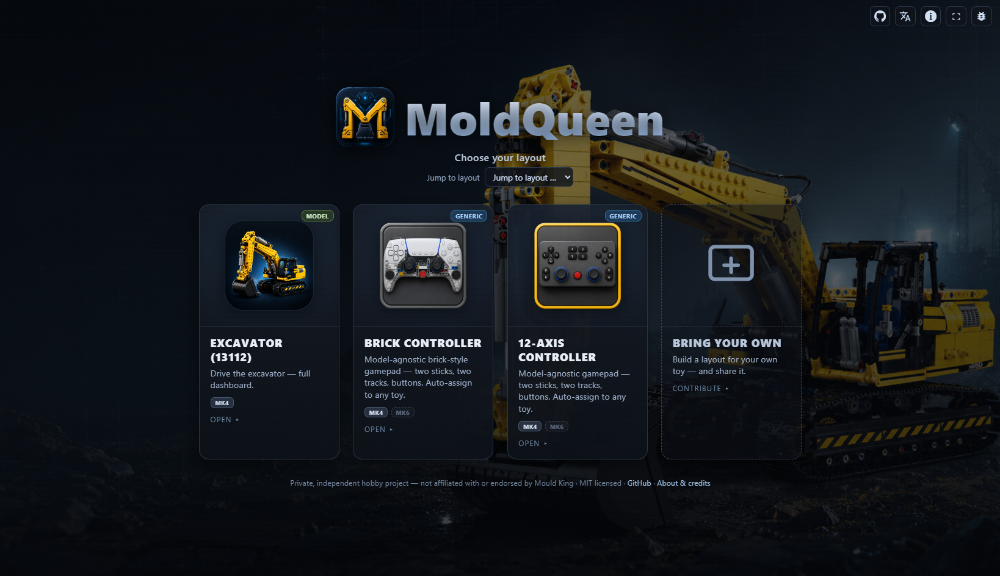
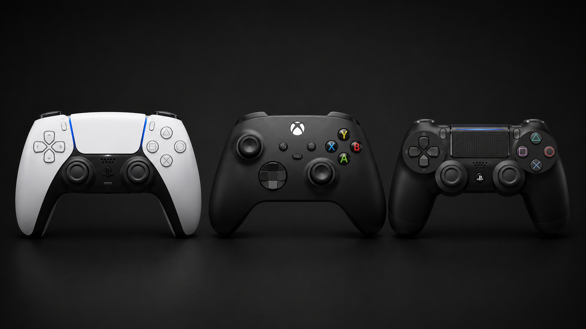
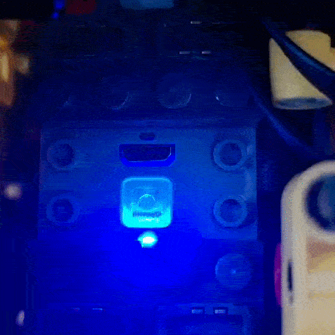
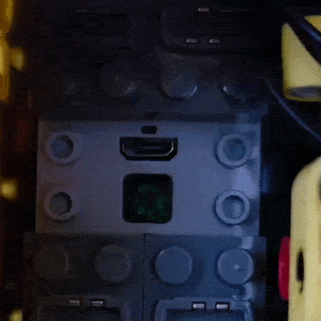
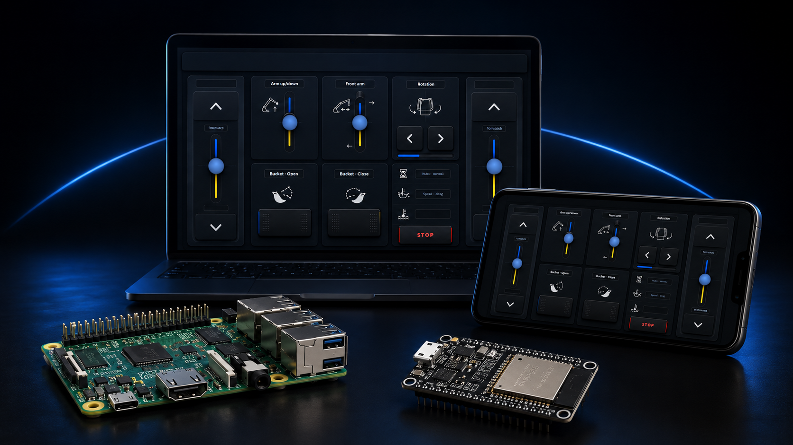

<h1> moldqueen</h1>

<!-- Restrained, mostly-monochrome badge row: flat-square, dark-slate (labelColor=23272e / color=2f343b),
     white logos. One sparing accent (muted green 2d6a4f) on the status badge only. -->
[](https://github.com/jrichter24/moldqueen/releases/latest)
[](https://jrichter24.github.io/moldqueen/)
[](LICENSE)


[](#what-it-does)
[](https://github.com/sponsors/jrichter24)
[](https://ko-fi.com/A437HBY)

**Drive a [Mould King](https://www.mouldking.com/) building-block RC toy — over a reverse-engineered BLE protocol, through one clean WebSocket API.**

<p align="center">
  
</p>

<p align="center">
  <b><a href="https://jrichter24.github.io/moldqueen/">jrichter24.github.io/moldqueen</a></b> — explore the project website
</p>

<p align="center">
  <a href="https://github.com/sponsors/jrichter24" target="_blank"></a>
  &nbsp;
  <a href="https://ko-fi.com/A437HBY" target="_blank"></a>
  <br><sub>Free &amp; open source. No ads, no affiliate links.</sub>
</p>

## Download — install the app

**📲 [Latest signed release](https://github.com/jrichter24/moldqueen/releases/latest)** — the standalone **Android app**, signed by the author.

1. Download **`moldqueen-v0.1.2.apk`** from the [latest release](https://github.com/jrichter24/moldqueen/releases/latest).
2. On your phone, allow **install from unknown sources** for your browser or file manager (Android prompts the first time).
3. Open the APK to install, then launch **MoldQueen → Connect → Ready → drive**.

It's one self-contained app — it owns the radio *and* serves the UI on-device, so no Pi or network is needed.
Prefer to build it yourself? `cd android-core && ./gradlew installDebug` (over USB).
**F-Droid:** MR [!41291](https://gitlab.com/fdroid/fdroiddata/-/merge_requests/41291) under
review. The **Raspberry Pi** path is in [Quickstart](#quickstart) below.

## The idea: API-first — thin transport, smart client

moldqueen is built around **one documented WebSocket contract** and an unusual split:

- **The radio core is a _thin transport_.** It takes a raw `set {slot, channel, value}`,
  turns it into a Mould King BLE "telegram," crypts it, and broadcasts it. It knows
  **nothing** about functions, channel maps, inversion, caps, or your specific toy.
- **A single web client is the _smart_ half.** It resolves *function → (slot, channel,
  value)*, owns the per-layout channel map, and runs the keepalive + STOP safety latch.

Because all the smarts live above the contract, **the radio core is swappable**: a
**Raspberry Pi** (raw HCI/BlueZ), a **standalone Android app** (native BLE), and an
**ESP32-S3** (ESP-IDF + NimBLE, over WiFi) each expose the *identical* WebSocket API and
serve the *same* client — so the UI is written once and the hardware is pluggable
(*swap the radio core, keep the client*). (The hubs are driven by *broadcasting* crafted BLE adverts, not over
GATT.) The **Mould King 13112 excavator** is the hardware-proven reference; the
layout system + auto-assign let you drive **any** Mould King toy on these hubs.

## Quickstart

### Raspberry Pi (primary path)

Pi with a USB BLE dongle, Python 3.13, a solid 5 V/3 A PSU:

```bash
git clone https://github.com/jrichter24/moldqueen && cd moldqueen
scripts/start.sh        # frees the adapter from bluetoothd, brings the dongle up by MAC, runs both processes
# → open http://<pi>:8080/  →  Connect  →  button one hub to slot 1  →  Ready  →  drive
```

With `avahi-utils` installed the Pi is discoverable by name as **`moldqueenrasp.local`**
(`ws://moldqueenrasp.local:8765`), mirroring the ESP32's `moldqueenesp.local` — additive, the IP
still works. Full prep (disable onboard BT, mask `bluetoothd`, caps), mDNS, and a dry-run mode:
**[`dev-docs/QUICKSTART.md`](dev-docs/QUICKSTART.md)**.

<p align="center">
  
</p>

---

### ESP32-S3 (the third radio core)

A tiny ESP-IDF + NimBLE board that drives real toys
over WiFi today, exposing the same WebSocket contract as the Pi and Android cores. It's a
usable standalone appliance: no credentials are baked in, so on first boot it opens a setup
WiFi (`moldqueen-setup`) for you to enter your network; after that it's discoverable as
`moldqueenesp.local` and carries a built-in management page at `moldqueenesp.local:8080`
(status, restart, switch-to-setup, change-network). Point the client at
`ws://moldqueenesp.local:8765` and drive.
Step-by-step setup walkthrough: **[`dev-docs/ESP32_SETUP.md`](dev-docs/ESP32_SETUP.md)**.

<p align="center">
  
</p>

---

### Android (standalone, no Pi)

Own native radio + bundled client in one APK:

```bash
cd android-core && ./gradlew installDebug    # build + install to a connected device
# → open the MoldQueen app  →  Connect  →  Ready  →  drive
```

Build/device detail: **[`dev-docs/ANDROID.md`](dev-docs/ANDROID.md)**.

<p align="center">
  
</p>

> **Just exploring?** Run the client alone against a Pi —
> **[`dev-docs/DEV_CLIENT.md`](dev-docs/DEV_CLIENT.md)** (dev server) or
> **[`dev-docs/REMOTE_CLIENT.md`](dev-docs/REMOTE_CLIENT.md)** (Docker).

## What it does

<p align="center">
  
</p>

- **Layouts** — pick one from the start-page chooser:
  - **Excavator** (model-specific): landscape HMI dashboard, drag-joysticks + hold buttons.
  - **12-axis** and **Brick / PS-like** (model-agnostic): generic gamepads with **12 motors**
    you map to any toy.
  - **RAW** (debug): a protocol bench over the raw `set`/`stop` path (slot/channel/value,
    telegram + on-air bytes console).
- **Chooser / start page** — cards with a **Generic / Model** badge and **MK4 / MK6**
  protocol badges (MK6 greyed = coming soon), a **jump-to-layout** dropdown, and the RAW
  bench behind a debug icon.
- **One shared chrome (MK4Chrome)** — every layout gets the same menu, settings, connect
  wizard, status light, language picker, keyboard STOP, and gamepad path.
- **Profile-driven auto-assign** — map a generic controller's 12 motors to channels by
  toy *profile* (vehicle / car / custom) with an inline editor and a zero-box guide.
- **Gamepad** — pair a DualSense (or any) controller over Bluetooth and drive, on the
  excavator **and** the generic layouts — in the browser or the Android app; touch always
  works too. *(detail: [`dev-docs/GAMEPAD.md`](dev-docs/GAMEPAD.md))*

<p align="center">
  
</p>

- **6 languages** (EN/DE complete; ZH/KO/ES/FR seeded, EN fallback), editable per-layout
  title + colour.
- **Safety** — affirmative keepalive (the client re-affirms intent ~10/s; the server
  auto-neutralizes any un-refreshed channel) + STOP = kill-and-reconnect-at-neutral.
  [More ↓](#architecture) · 📸 [Screenshots](dev-docs/SCREENSHOTS.md).

## Connection wizard

Cold-starting these hubs is fiddly, so the **shared client chrome (MK4Chrome)** has a
guided **connection wizard**: it walks you from *power on* to *Ready*, and it shows the
hub's real **LED-flash patterns** so you can confirm you're talking to the right hub and
assigning the right slot (one long flash = powered on; fast flashing = connecting; button
a hub to one/two/three fast flashes to put it on slot 0/1/2). It's a **client feature, so
you get it on every layout and against every radio core** (Raspberry Pi or the standalone
Android app), not something Pi- or Android-specific.

<!-- The actual hub LED flash patterns the wizard teaches. Placeholder for richer
     real-device GIFs later (driving footage); for now these convey real hardware. -->
<p align="center">
  
  &nbsp;&nbsp;
  
  <br><sub>The wizard's real hub-LED flash patterns: <b>one long flash</b> = powered on, <b>fast flashing</b> = connecting.</sub>
</p>

## Architecture

Thin transport (server) + smart client (UI), with a swappable radio core behind one
WebSocket contract:

```
client/        # the INDEPENDENT smart web client (chooser · layouts · MK4Chrome · channel maps)
   │  ws://…:8765  (the contract: setup · set · stop · state · info)
   ├── linux-core/   # Pi radio core — raw HCI/BlueZ; serves the client (Python)
   ├── android-core/ # standalone Android radio core — native BLE; serves the client (Kotlin)
   └── esp32-core/   # ESP32-S3 radio core — ESP-IDF + NimBLE over WiFi (C)
```

<p align="center">
  
</p>

The client resolves *function → channel* and sends only low-level `set`; the core makes a
nibble, crypts it (`MouldKingCrypt`), and broadcasts the BLE telegram. One telegram drives
all hubs at once (12 nibbles = 3 slots × 4 channels). Deep dive — protocol, crypto, the
dual-radio finding, the WS contract: **[`dev-docs/PROJECT.md`](dev-docs/PROJECT.md)** (the
source of truth) and the machine-readable **[`asyncapi.yaml`](linux-core/mk4web/asyncapi.yaml)**.

| Run it… | How | Detail |
|---|---|---|
| On the Pi (served) | `scripts/start.sh` → `http://<pi>:8080/` | [QUICKSTART](dev-docs/QUICKSTART.md) |
| Android (standalone) | `./gradlew installDebug` | [ANDROID](dev-docs/ANDROID.md) |
| On an ESP32-S3 (over WiFi) | `idf.py flash` → join `moldqueen-setup`, enter WiFi → `ws://moldqueenesp.local:8765` | [PORTING](dev-docs/PORTING.md) |
| Client on the desktop | `client/serve.py` → point at a Pi | [DEV_CLIENT](dev-docs/DEV_CLIENT.md) |
| Client in Docker | `Dockerfile.client` → point at a Pi | [REMOTE_CLIENT](dev-docs/REMOTE_CLIENT.md) |
| On another board | port the thin-transport core (the cores are hardware-bound) | [PORTING](dev-docs/PORTING.md) |
| Add your own toy/layout | a generic slot/channel layout, no core fork | [ADDING_A_LAYOUT](dev-docs/ADDING_A_LAYOUT.md) |

## Roadmap

The **ESP32-S3 radio core** is now a working third sibling, a usable standalone appliance.
It drives real toys over WiFi today (clean-room C `MouldKingCrypt` port, NimBLE `0xFFF0`
advertiser, 300 ms auto-neutral safety, WiFi WebSocket server mirroring the Pi's `api.py`),
plus **WiFi provisioning** (no creds baked in: a fallback `moldqueen-setup` AP + a branded
bilingual setup page), **mDNS discovery** as `moldqueenesp.local`, and a **management page**
at `moldqueenesp.local:8080` (status, restart, switch-to-setup, change-network). What's still
ahead:

- **ESP32 finishing:** Pi mDNS (`moldqueenrasp.local` for linux-core), then the binary/release
  pipeline (a distributable `.bin`); serve-client-from-flash after.
- **MK6 protocol support** — the greyed *MK6* card badges; second Mould King BLE variant.
- **Camera, ToF sensor** — telemetry over/alongside the API.
- **AI brain / console client** — an agent driving the toy through the same WebSocket API.

Detail + status: **[`dev-docs/ROADMAP.md`](dev-docs/ROADMAP.md)**.

## Contributing

Issues, PRs, and especially new toy layouts are welcome. See
**[`CONTRIBUTING.md`](CONTRIBUTING.md)** for how to contribute and the conventions to
respect (thin transport / smart client, one client / no forks, the safety model). It
also explains why this repo **keeps its AI-assisted-workflow files (`CLAUDE.md` + the
`.claude/agents/`) in version control on purpose** — for transparency about how the
project is built, and as a working example you can copy for your own setup.

## Credit & attribution

Building on, forking, or reusing moldqueen? A credit back is genuinely appreciated — it's
MIT-licensed, so this is a **request, not a requirement**. Drop this line in your README,
About screen, or docs:

```markdown
Built with [MoldQueen](https://github.com/jrichter24/moldqueen) — https://jrichter24.github.io/moldqueen/
```

→ Built with **[MoldQueen](https://github.com/jrichter24/moldqueen)** — <https://jrichter24.github.io/moldqueen/>

## Credits, license & disclaimer

- **Author:** Dr. Jens Richter — physics & electrical engineering; by day, tour optimization
  with genetic/AI algorithms at [DNA Evolutions](https://www.dna-evolutions.com/)
  ([LinkedIn](https://www.linkedin.com/in/li-jens-richter)). *Built for my son Jonas, who
  loves excavators.* AI coding assistants helped with implementation. Architecture, product
  decisions, testing, and final code review remained under human control.
- **Protocol groundwork:** [`J0EK3R/mkconnect-python`](https://github.com/J0EK3R/mkconnect-python)
  — our `mouldking_crypt.py` is a **port/derivative of `MouldKingCrypt`, used under the MIT
  License** (© 2024 J0EK3R), verified byte-exact against the MK+tech app; see
  [`THIRD-PARTY-NOTICES.md`](THIRD-PARTY-NOTICES.md). Additional reference:
  [BrickController2](https://github.com/imurvai/brickcontroller2).
- **Independent & unofficial** — **not** affiliated with, authorized by, or endorsed by
  Mould King / Shenzhen Yuxing; trademarks used descriptively. The BLE protocol was
  reverse-engineered for interoperability with hardware the author owns, for educational /
  personal use. Provided **"as is", without warranty — you assume all risk.**

**License:** [MIT](LICENSE) © 2026 Jens Richter. Bundled third-party code keeps its own
license — see [`THIRD-PARTY-NOTICES.md`](THIRD-PARTY-NOTICES.md).
