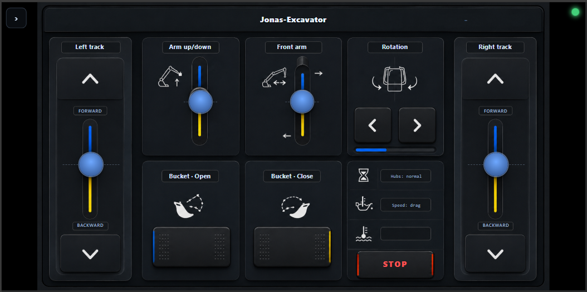
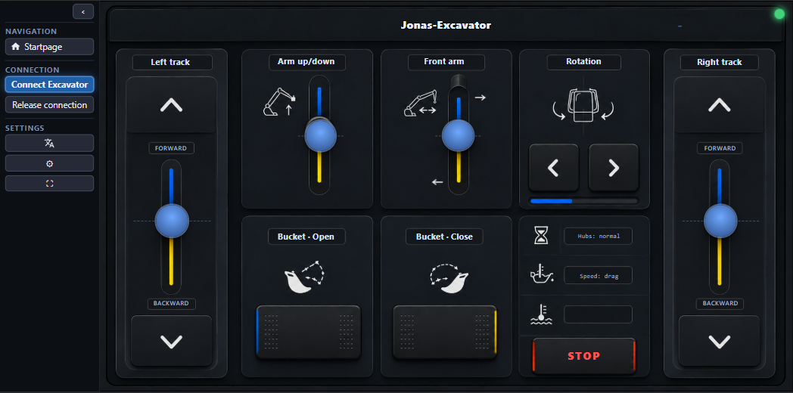

# Android — the standalone radio core

The `android-core/` app is a **second radio core**: it does on a phone what the Pi does,
behind the **same WebSocket contract**. No Pi, no laptop, no network — it owns the radio
*and* serves the UI, all on-device. (Back to the [README](../README.md) ·
architecture in [PROJECT.md](PROJECT.md).)

<p align="center">
  
</p>

## What it is

One Android service (`Mk4Service`) wiring three things together:

- **Native BLE radio** (`BleBroadcaster`) — broadcasts Mould King MK4 telegrams
  (company `0xFFF0`) using Android's **`AdvertisingSet`** API. It updates the *running*
  advertiser **in place** (`setAdvertisingData`, on change only — no stop/start churn),
  legacy connectable adverts at ~100 ms (≈10/s), which is what holds a hub connected.
  STOP is **kill-and-reconnect-at-neutral** (kill the advertiser → settle → connect →
  neutral) — see [GAMEPAD.md](GAMEPAD.md)/the safety model. Codec: a Kotlin
  `MouldKingCrypt`, byte-exact against the stock app.
- **Local WebSocket API** on `ws://127.0.0.1:8765` (`Mk4WsServer`) — a clean-room port of
  `linux-core/mk4web/api.py`: the **identical thin-transport contract**
  (`setup`/`set`/`stop`/`state`/`info`; pushes `lifecycle`/`state`/`info`), the
  IDLE→CONNECTING→READY lifecycle, and the per-channel affirmative-keepalive
  dead-man's-switch. It holds **no** channel map — the client resolves everything.
- **Local HTTP server** on `http://127.0.0.1:8080` (`ClientHttpServer`, NanoHTTPD) — serves
  the **bundled client** (chooser, layouts, `/asyncapi.yaml`, assets), deriving routes from
  `layouts.json` exactly like the Pi, and injecting the WS port.

A full-immersive, landscape-locked **WebView** (`MainActivity`) loads
`http://localhost:8080/` — so on the phone you get the *same* chooser + layouts + MK4Chrome
as on the Pi, talking to the *same* contract.

<p align="center">
  
  
</p>

**The client is single-sourced.** A Gradle `bundleClient` task copies `client/web` +
`client/assets` into the app's assets at build time — there is no second copy of the UI to
maintain; the phone serves the same `client/` the Pi does.

## Build & install

Toolchain: **Kotlin 1.9.24 · Gradle 8.9 · JDK 17 · AGP 8.7.3 · minSdk 31 / compileSdk +
targetSdk 35** (the current Google Play floor, Android 15). The SDK needs `platform-35` +
`build-tools;35.0.0` installed (via Android Studio's SDK Manager or `cmdline-tools`); the
Gradle wrapper fetches Gradle itself. Package `io.github.jrichter24.moldqueen`
(app name **MoldQueen**).

**Versioning (committed + deterministic — F-Droid/Play ready).** The release version is
**`versionName "0.1.0"` / `versionCode 10000`**, set in [`app/build.gradle`](../android-core/app/build.gradle)
from three numbers (`verMajor/verMinor/verPatch`) — it reads **no** gitignored counter, so a
fresh from-source checkout reproduces it exactly. **To bump a release**, edit those three
numbers; `versionCode` is derived as `major*1_000_000 + minor*10_000 + patch*100`:

| version | versionCode |
|---|---|
| 0.1.0 | 10000 |
| 0.1.1 | 10100 |
| 0.2.0 | 20000 |
| 1.0.0 | 1000000 |

Debug builds append the short git SHA (`0.1.0-debug+<sha>`, "local" outside a git checkout)
so each is identifiable on-device; the in-app server-info shows the running `versionName`.

```bash
cd android-core
./gradlew installDebug        # build + install to a connected device (adb)
#   or: ./gradlew assembleDebug   → app/build/outputs/apk/debug/app-debug.apk
adb shell am start -n io.github.jrichter24.moldqueen/.MainActivity
```

Then in the app: **Connect → Ready → drive** (the connect wizard guides the hub buttoning,
same as the Pi). Grant the **Bluetooth (advertise/connect)** permission when prompted.

Notes:
- Requires Android 12+ (runtime `BLUETOOTH_ADVERTISE` / `BLUETOOTH_CONNECT` + `INTERNET`).
  `network_security_config.xml` permits cleartext only to `localhost` (for the loopback
  HTTP/WS); everything else stays HTTPS-only.
- Verified on a **Samsung Galaxy S25**; landscape-locked on any device.
- **Gamepad:** pair a controller over Bluetooth and drive — touch works fully too.
  See [GAMEPAD.md](GAMEPAD.md).

## Release signing

Debug builds are auto-signed with the standard debug key (unchanged). **Release** signing
reads credentials at build time — **nothing secret is ever committed** — in this order:

1. **Env vars (CI / GitHub Secrets):** `MOLDQUEEN_KEYSTORE_FILE` (path to the decoded
   `.p12`), `MOLDQUEEN_KEYSTORE_PASSWORD`, `MOLDQUEEN_KEY_ALIAS` (default `moldqueen`),
   `MOLDQUEEN_KEY_PASSWORD`.
2. **Local:** a gitignored `android-core/keystore.properties`
   (`storeFile`/`storePassword`/`keyAlias`/`keyPassword`) — copy
   [`keystore.properties.example`](../android-core/keystore.properties.example) and fill it in.
3. **Neither present → the release builds UNSIGNED and still succeeds.** This is the default
   and it's required: the CI test gate's `assembleRelease`, contributors without a keystore,
   and **F-Droid's from-source build (which signs with its own key)** all depend on it.
   Signing is applied *only* when credentials exist; the build never hard-fails for lack of them.

The keystore is a **PKCS12 (`.p12`)**, alias **`moldqueen`**, kept **outside the repo**
(`.gitignore` blocks `*.p12` / `*.jks` / `*.keystore` / `keystore.properties`). With one of the
above present, `./gradlew assembleRelease` (APK) or `bundleRelease` (AAB for Play) emits a
signed build; the signed-release CI workflow itself is a separate step.

## Maturity & next steps

The radio/API/serving path is **working and feature-complete** (safety verified on S25);
the app is also a reference implementation for any future mobile core. **Future:** a
**signed release / Play-Store** build (today it's a local `installDebug`); see
[ROADMAP.md](ROADMAP.md).
