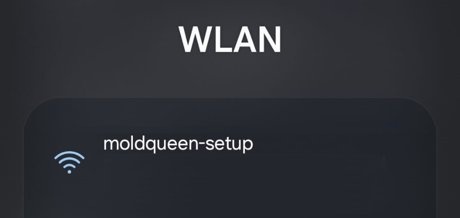
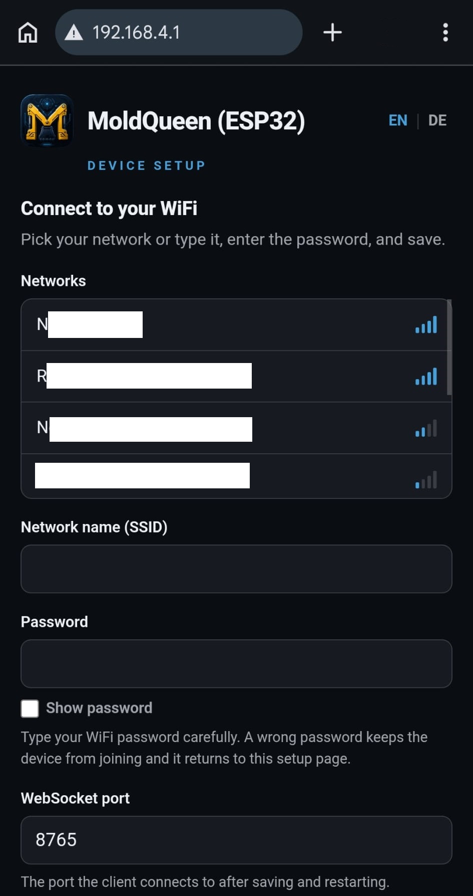
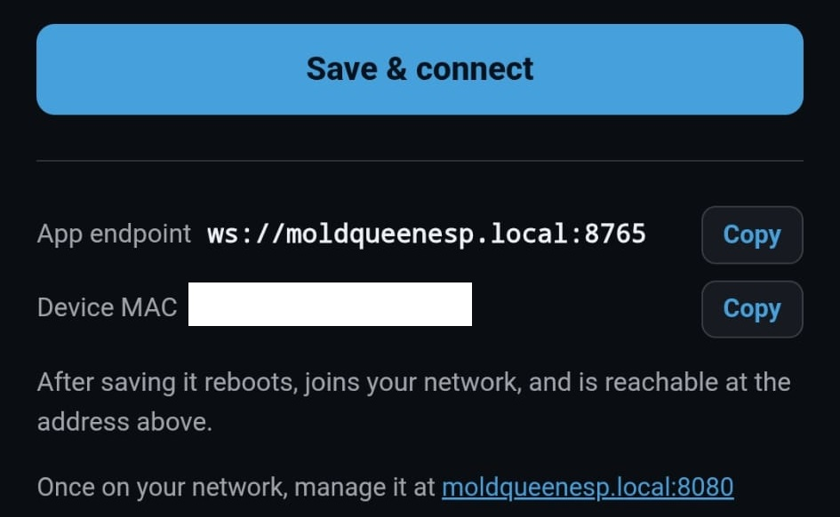
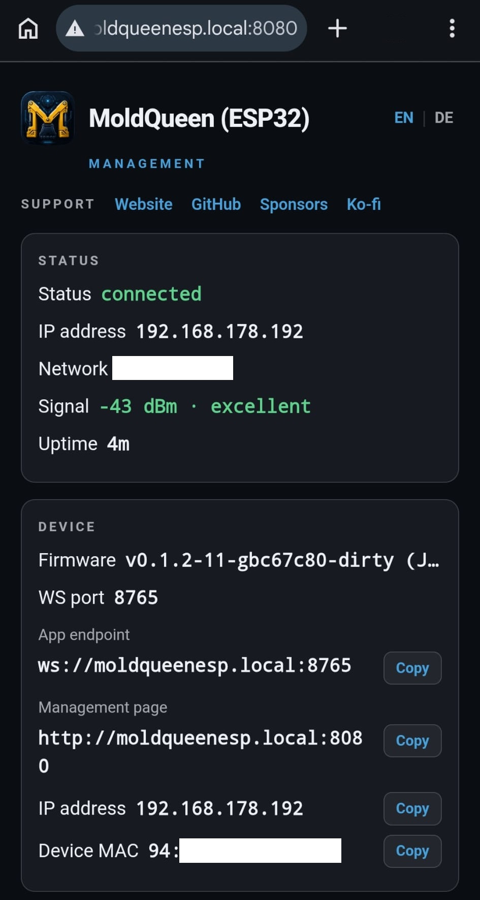
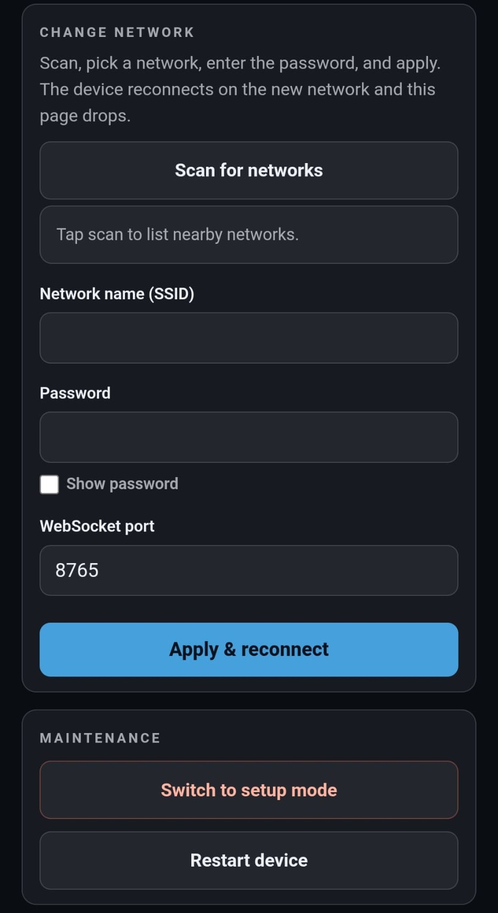

# ESP32 setup - from a flashed board to driving over WiFi

The canonical written walkthrough for the **ESP32-S3 radio core**: how a freshly flashed
board gets onto your WiFi and how you reach and manage it afterwards. The website carries a
visual quick version of these same steps (the step slider in the **ESP32 setup** section of
[the landing page](https://jrichter24.github.io/moldqueen/#esp-setup)); this is the detailed
reference. For building and flashing the firmware, see
[`../esp32-core/README.md`](../esp32-core/README.md).

The ESP32 core is the third moldqueen radio core, a peer to the Raspberry Pi
([`linux-core/`](../linux-core/)) and Android ([`android-core/`](../android-core/)) cores. It
speaks the **same WebSocket contract** and is driven by the **same single-source client**:
swap the radio core, keep the client.

## What you need

- An **ESP32-S3** board with the moldqueen firmware flashed (this build targets the Heemol
  **ESP32-S3 N16R8 DevKitC-1**). Flashing is covered in
  [`../esp32-core/README.md`](../esp32-core/README.md).
- A phone or laptop with WiFi, to run the setup page.
- Your home WiFi name and password.
- A moldqueen client to drive from (the Pi, `client/serve.py`, or any host serving the
  client). The ESP32 itself does **not** serve the client; it is the radio core only.

No credentials are baked into the firmware or committed to git. The board has no WiFi
details until you enter them, so on first boot it opens its own setup network.

## Step 1 - Join the setup WiFi

On first boot (empty NVS), the board starts an **open** SoftAP named **`moldqueen-setup`**.
Join it from your phone or laptop. It needs no password.

The board also re-enters this setup mode automatically if a previously saved network is
unreachable, and you can force it on demand from the management page (see below).



## Step 2 - Open the setup page

With the setup WiFi joined, browse to **`http://192.168.4.1/`**. This is the board's branded,
bilingual (EN/DE) setup page. It is fully self-contained and works offline: the icon, CSS and
JavaScript are all inlined, so it loads even though the setup AP has no internet.

This page is **not** the moldqueen client. It is a small configuration page served by the
board only while it is in setup mode.



## Step 3 - Pick your network and port

The setup page scans for nearby networks and lists them strongest-first with their signal
strength. Tap your network to fill in its name, then:

1. Enter your WiFi **password** (there is a show-password toggle if you want to check it).
2. Optionally set the **WebSocket port** (default **8765**). This is the port the client will
   connect to.
3. Save.

The page shows your device **MAC** and the resulting `ws://moldqueenesp.local:<port>` endpoint
with copy buttons. On save, the board stores the credentials and port to flash (NVS), shows a
matching branded confirmation page, and reboots into station mode to join your network.



## Step 4 - Reach the board by name

After the reboot the board joins your home WiFi and announces itself over mDNS as
**`moldqueenesp`**. Back on your own network, open the status and management page at:

```
http://moldqueenesp.local:8080
```

Discovery is by name, so there is no IP to look up in the usual case.

**If `.local` does not resolve:** some networks or clients do not handle mDNS. In that case
find the board's IP and use it directly. The board prints its IP over the serial monitor on
boot, and the management page shows the IP in its status card. You can also look up the IP in
your router by the device **MAC** shown on the setup page. Then reach the board at
`http://<ip>:8080` and point the client at `ws://<ip>:<port>`.



## Step 5 - Manage the board and drive

The management page (port **8080**, branded and bilingual) is organized into cards:

- **Status** - IP, MAC, SSID, signal, uptime, firmware, and the WebSocket endpoint, each with
  a copy button.
- **Restart** - reboot the board.
- **Switch to setup** - reboot back into the `moldqueen-setup` AP on demand, for re-provisioning.
- **Change network** - scan and enter new credentials; the board reboots to join the new
  network, and falls back to the setup AP if the new credentials are wrong, so bad details
  never lock you out.

To drive, point the moldqueen client's WebSocket endpoint at:

```
ws://moldqueenesp.local:<port>
```

(default port **8765**; use the IP form if `.local` does not resolve). Then connect and drive
exactly as you would against the Pi or Android cores.



## Notes

- Only **one** Mould King transmitter (company `0xFFF0`) should be advertising at a time. If
  you are testing the ESP32, make sure the Pi broadcaster and the phone app are not also
  advertising.
- The management page and the WebSocket API are **unauthenticated and LAN-only by design**,
  consistent with the rest of moldqueen's local-only model.
- A full credential wipe is done by erasing flash and reflashing (`idf.py -p <port>
  erase-flash`, then flash again); see [`../esp32-core/README.md`](../esp32-core/README.md).

Note the Pi core is not yet discoverable as `moldqueenrasp.local`; that mDNS name is planned,
not shipped. Only the ESP32 (`moldqueenesp.local`) is discoverable by name today.
