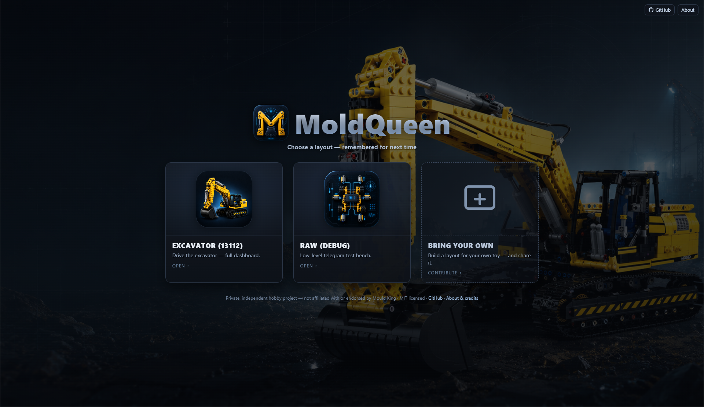
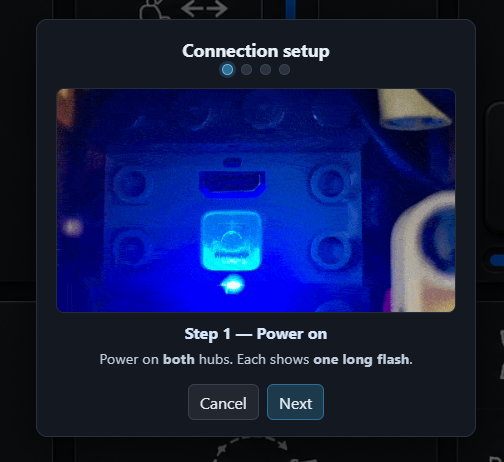
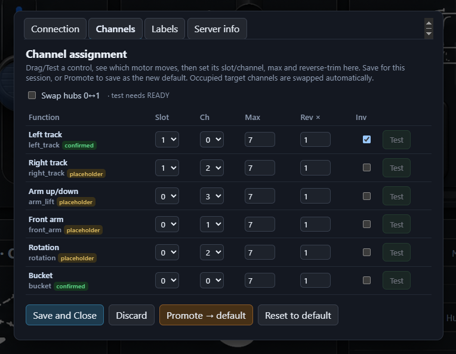

# Screenshots

A short visual tour of moldqueen — from the start page to driving the excavator and
assigning channels. (Back to the [README](../README.md).)

## Start page — layout chooser

Pick a layout (Excavator or RAW); your choice is remembered for next time.

## Excavator dashboard

The landscape control layout over an HMI background: drag-joysticks for the tracks and
arms, press-and-hold buttons for rotation and bucket, live status, and a big STOP.

## Connection wizard

A guided cold-start. Step one: power on both hubs, then connect the physical excavator
over BLE before the controls unlock.

## Settings — channel assignment

Map each function to a slot/channel: drive a control, see which motor moves, then set
its channel, max speed, reverse-trim and invert — save for the session or promote to
the default.

