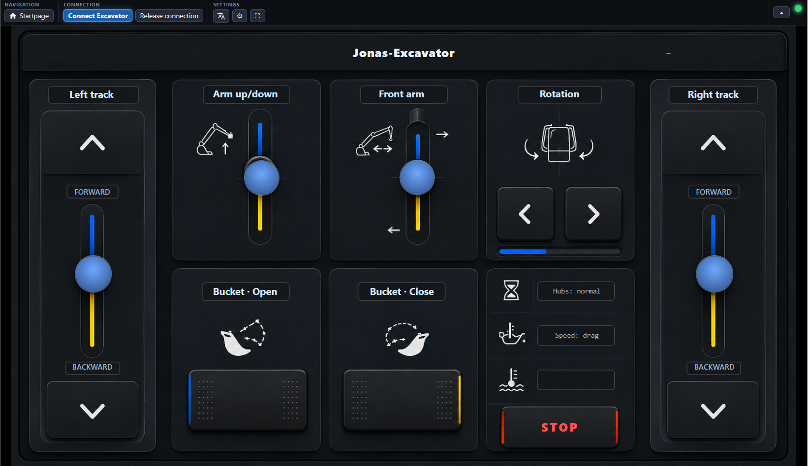
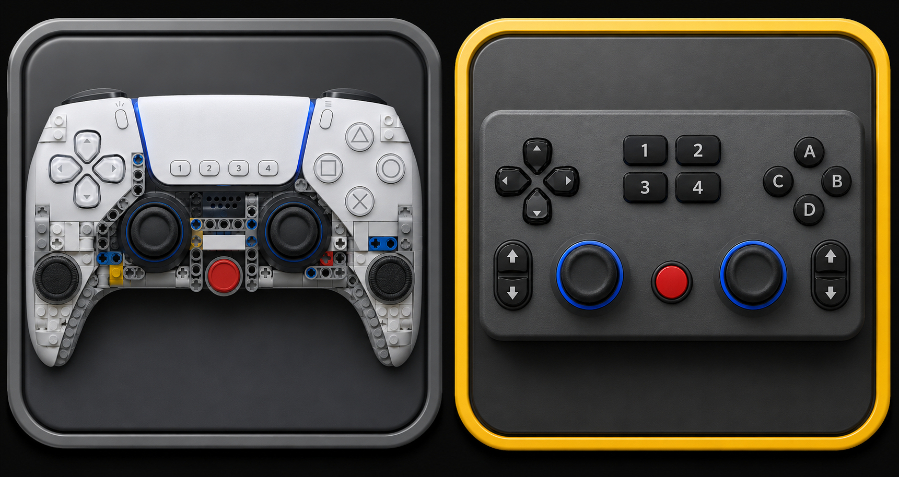

# Screenshots

A visual tour of the current moldqueen UI, from the chooser to driving a machine. The
same web client runs on the Pi, in the browser, and inside the Android app. (Back to the
[README](../README.md).)

## Start page (the chooser)

Open moldqueen and you land here. Every layout is a card with the same live
**Generic / Model** and **MK4 / MK6** badges as the app; pick one and drive.

## Excavator dashboard

The model-specific layout for the Mould King 13112: a landscape dashboard over the HMI
art, with drag-joysticks for the tracks and arms, hold-buttons for rotation and bucket,
a live status light, and a hardware STOP. The menu, settings, connect wizard, language
picker and STOP are the shared chrome (MK4Chrome) that every layout gets.

## Generic layouts (any twelve-motor toy)

Two model-agnostic controllers: a brick-built gamepad and a 12-axis grid. They map
themselves to your machine with a guided auto-assign, so you don't need a bespoke
dashboard for every toy.

## Gamepad

Pair a DualSense (or any controller) over Bluetooth and drive, on the excavator and on
the generic layouts, in the browser or in the Android app. Touch keeps working alongside
it. (See [GAMEPAD.md](GAMEPAD.md).)

## On Android (standalone)

The Android app is a second radio core: it owns the phone's Bluetooth, serves the same
client on-device, and needs no Pi. Here it drives a brick-built controller layout.

The shared chrome looks the same on the phone. Menu closed, then open:

  
  

## On the Raspberry Pi

The reference radio core: Python and raw Bluetooth HCI on a Pi with a BLE USB dongle.
It also serves the web client at `http://<pi>:8080/`. (See [QUICKSTART.md](QUICKSTART.md).)

## Run anywhere

Because the radio core sits behind one WebSocket contract, the same UI runs on a Pi, an
Android phone, a laptop, or against an ESP32 core later.

